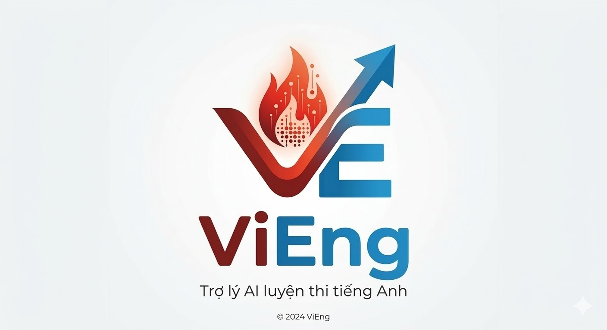

<p align="center">
  
</p>

<h1 align="center">ViEng</h1>
<p align="center">
  <strong>AI-Powered English Exam Preparation Platform</strong>
</p>
<p align="center">
  Trợ lý luyện thi TOEIC/IELTS cho sinh viên Việt Nam
</p>

<p align="center">
  
  
  
  
  
</p>

<p align="center">
  <strong>Demo</strong><br />
  <video src="https://raw.githubusercontent.com/LeNhan18/ViEng/main/Image/ViEng.mp4" controls width="640"></video>
  <br />
  <em>Nếu video không phát, <a href="https://github.com/LeNhan18/ViEng/blob/main/Image/ViEng.mp4?raw=true">bấm vào đây để xem</a></em>
</p>

<p align="center">
  <strong>Demo ViEng2</strong><br />
  <a href="https://www.youtube.com/watch?v=U4Ak4mDY-zk">▶ Xem demo ViEng2 (video dự án)</a>
</p>

---

## Mục lục

- [Giới thiệu](#giới-thiệu)
- [Tính năng](#tính-năng)
- [Tech Stack](#tech-stack)
- [Cài đặt](#cài-đặt)
- [Cấu hình](#cấu-hình)
- [API Reference](#api-reference)
- [Knowledge Base](#knowledge-base)
- [Fine-tuning](#fine-tuning)
- [Roadmap](#roadmap)
- [License](#license)

---

## Giới thiệu

**ViEng** là nền tảng luyện thi tiếng Anh sử dụng AI, được thiết kế riêng cho sinh viên Việt Nam. Có **web** (React) và **mobile** (Flutter Android). Ứng dụng kết hợp **RAG (Retrieval-Augmented Generation)** với **Large Language Models** để tạo đề thi chuẩn TOEIC/IELTS, giải thích đáp án theo ngữ cảnh, dịch thuật thông minh và chatbot hỏi đáp — tất cả theo phong cách "thầy cô Việt" thân thiện, dễ hiểu.

### Điểm nổi bật kỹ thuật

| Thành phần | Mô tả |
|------------|-------|
| **RAG Pipeline** | ChromaDB + sentence-transformers (multilingual) — truy xuất ngữ pháp/từ vựng từ knowledge base khi tạo đề và giải thích |
| **LLM** | Groq (Llama-3.3-70B) / OpenAI (GPT-4o-mini) / Fine-tuned Qwen2.5-7B |
| **Fine-tuning** | QLoRA + Unsloth trên Colab T4; dataset 500+ mẫu RAG-augmented |
| **TTS** | Edge TTS (miễn phí) — phát âm tiếng Anh khi dịch Việt→Anh |

---

## Tính năng

### Làm bài thi TOEIC Reading

- **Part 5** — Incomplete Sentences (hoàn thành câu)
- **Part 6** — Text Completion (hoàn thành đoạn văn)
- **Part 7** — Single & Multiple Passages (đọc hiểu)

Đề thi được sinh đúng format chuẩn TOEIC, có RAG context từ knowledge base.

### Giải thích theo từng Part

- **Part 5**: Tập trung ngữ pháp, từ vựng trong câu đơn
- **Part 6 & 7**: Hướng về đoạn văn — trích dẫn ngữ cảnh, mạch văn, chứng minh đáp án

### Chatbot RAG + LLM

Hỏi đáp ngữ pháp, từ vựng TOEIC/IELTS — AI trả lời dựa trên knowledge base, có nguồn tham khảo.

### Dịch thuật AI

- Dịch Anh↔Việt thông minh
- Kèm từ vựng quan trọng và ghi chú ngữ pháp
- **Phát âm TTS**: Nút "Đọc phát âm" khi dịch Việt→Anh (Edge TTS)

### Knowledge Base

- Hỗ trợ **.txt** và **.pdf**
- Index vào ChromaDB để RAG sử dụng khi tạo đề, giải thích, chatbot

---

## Tech Stack

| Layer | Công nghệ |
|-------|-----------|
| **Backend** | Python 3.11, FastAPI |
| **Web** | React 19, Vite 6, TailwindCSS 4 |
| **Mobile** | Flutter (Android) |
| **LLM** | Groq / OpenAI / HuggingFace (fine-tuned) |
| **RAG** | LangChain, ChromaDB |
| **Embeddings** | sentence-transformers (paraphrase-multilingual-MiniLM) |
| **TTS** | edge-tts |
| **Fine-tune** | Unsloth, QLoRA |

---

## Cài đặt

### Yêu cầu

- Python 3.11+
- Node.js 18+ (cho web)
- Flutter SDK (cho mobile)
- API key: Groq hoặc OpenAI

### Bước 1: Clone repository

```bash
git clone https://github.com/LeNhan18/ViEng.git
cd ViEng
```

### Bước 2: Backend

```bash
python -m venv venv

# Windows
venv\Scripts\activate

# macOS / Linux
source venv/bin/activate

pip install -r requirements.txt
```

### Bước 3: Web (React)

```bash
cd frontend
npm install --legacy-peer-deps
cd ..
```

### Bước 4: Mobile (Flutter)

```bash
cd androidfrontend
flutter pub get
cd ..
```

### Bước 5: Chạy ứng dụng

**Web:**
```bash
# Terminal 1 — Backend
uvicorn app.main:app --reload

# Terminal 2 — Web
cd frontend && npm run dev
```

**Mobile:**
```bash
# Backend phải chạy trước
cd androidfrontend && flutter run
```

| URL / Platform | Mô tả |
|----------------|-------|
| http://localhost:5173 | Ứng dụng web |
| http://localhost:8000/docs | API Swagger |
| Android | Flutter app (androidfrontend) |

---

## Cấu hình

1. Sao chép file môi trường:
   ```bash
   cp .env.example .env
   ```

2. Cấu hình API key trong `.env`:

   | Biến | Mô tả |
   |------|-------|
   | `GROQ_API_KEY` | [Groq Console](https://console.groq.com) — miễn phí |
   | `OPENAI_API_KEY` | [OpenAI](https://platform.openai.com) — trả phí |

3. (Tùy chọn) Fine-tuned model:
   ```env
   USE_FINETUNED_MODEL=true
   HF_MODEL_NAME=LeNhan18/ViEng-Qwen2.5-7B-lora
   ```

---

## API Reference

| Method | Endpoint | Mô tả |
|--------|----------|-------|
| `GET` | `/api/v1/health` | Health check |
| `POST` | `/api/v1/test/generate` | Tạo đề thi TOEIC (Part 5/6/7) |
| `POST` | `/api/v1/test/submit` | Nộp bài, nhận feedback + giải thích |
| `POST` | `/api/v1/chat` | Chatbot RAG — hỏi đáp ngữ pháp/từ vựng |
| `POST` | `/api/v1/translate` | Dịch thuật AI (EN↔VI) + từ vựng + ngữ pháp |
| `POST` | `/api/v1/tts` | Text-to-Speech — phát âm tiếng Anh |
| `GET` | `/api/v1/rag/list` | Liệt kê chunks trong vectorstore |
| `POST` | `/api/v1/rag/index` | Index knowledge base |
| `POST` | `/api/v1/rag/search` | Tìm kiếm trong knowledge base |

---

## Knowledge Base

Đặt tài liệu vào `data/knowledge_base/`:

| Định dạng | Ghi chú |
|-----------|---------|
| `.txt` | Grammar, từ vựng, strategies — encoding UTF-8 |
| `.pdf` | Sách, đề thi TOEIC/IELTS (pypdf) |

Index vào vectorstore:

```bash
curl -X POST http://localhost:8000/api/v1/rag/index
```

---

## Fine-tuning

ViEng hỗ trợ fine-tune Qwen2.5-7B với **RAG-augmented data** trên Google Colab:

1. **Index knowledge base** — đảm bảo `data/knowledge_base/` có file .txt hoặc .pdf
2. **Sinh dataset** — `python scripts/generate_finetune_dataset.py`
3. **Upload** `data/finetune_dataset.jsonl` lên Colab
4. **Chạy** `FineTune_ViEng.ipynb` (GPU T4)

Chi tiết xem trong notebook.

---

## Cấu trúc dự án

```
ViEng/
├── app/                # Backend FastAPI
│   ├── main.py
│   ├── api/routes.py
│   ├── core/config.py
│   ├── models/schemas.py
│   └── services/
│       ├── llm_service.py
│       └── rag_service.py
├── frontend/           # Web React
│   └── src/
│       ├── pages/     # Home, Exam, Result, Chat, Translate
│       └── components/
├── androidfrontend/    # Mobile Flutter (Android)
├── data/
│   ├── knowledge_base/ # .txt, .pdf
│   └── vectorstore/    # ChromaDB
├── scripts/
└── tests/
```

---

## Roadmap

| Trạng thái | Tính năng |
|------------|-----------|
| Done | TOEIC Reading Part 5/6/7 |
| Done | RAG pipeline + Knowledge base (.txt, .pdf) |
| Done | Chatbot RAG + LLM |
| Done | Dịch thuật + TTS phát âm |
| Done | Fine-tune Qwen2.5-7B (RAG-augmented) |
| Planned | TOEIC Listening (Part 1–4) |
| Planned | IELTS Reading/Writing |
| Planned | Lưu session & tiến độ học tập |

---

## Đối tượng

Sinh viên đại học, người đi làm cần chứng chỉ TOEIC/IELTS tại Việt Nam.

---

## License

MIT License — xem [LICENSE](LICENSE) để biết chi tiết.
