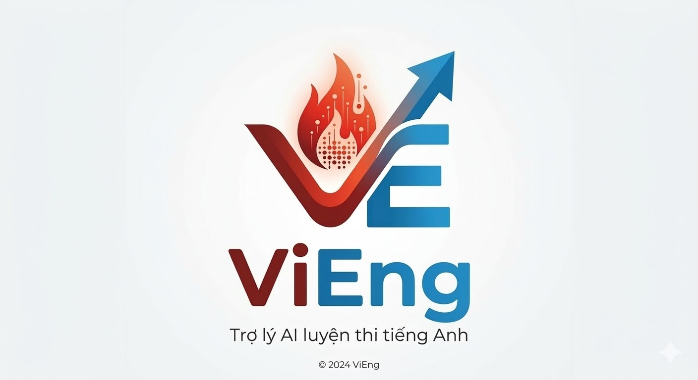
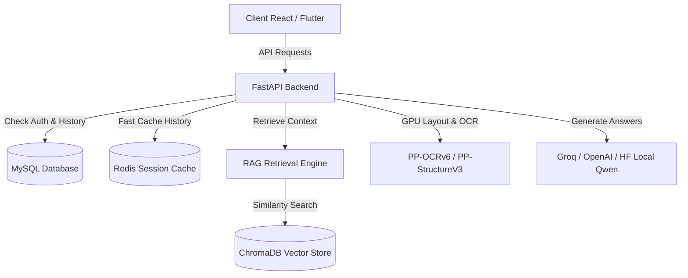

<p align="center">
  
</p>

<h1 align="center">ViEng</h1>

<p align="center">
  <strong>AI-powered TOEIC/IELTS exam preparation platform for Vietnamese learners</strong>
</p>

<p align="center">
  
  
  
  
  
  
  
  
</p>

<p align="center">
  <strong>Demo</strong><br />
  <video src="https://raw.githubusercontent.com/LeNhan18/ViEng/main/Image/ViEng.mp4" controls width="640"></video>
  <br />
  <em>If the video does not play, <a href="https://github.com/LeNhan18/ViEng/blob/main/Image/ViEng.mp4?raw=true">click here</a>.</em>
</p>

<p align="center">
  <strong>Demo (ViEng2)</strong><br />
  <a href="https://www.youtube.com/watch?v=U4Ak4mDY-zk">▶ Watch ViEng2 demo (project video)</a>
</p>

---

## Table of Contents

- [Overview](#overview)
- [Key Features & Limitations](#key-features--limitations)
- [System Architecture](#system-architecture)
- [Tech Stack](#tech-stack)
- [Installation & Quickstart](#installation--quickstart)
- [Environment Configuration](#environment-configuration)
- [LLM & VLM Providers](#llm--vlm-providers)
- [GPU Acceleration & Cache Redirect](#gpu-acceleration--cache-redirect)
- [API Reference](#api-reference)
- [Document Parsing & RAG Ingestion](#document-parsing--rag-ingestion)
- [Fine-tuning Workflow](#fine-tuning-workflow)
- [Project Structure](#project-structure)
- [Roadmap](#roadmap)
- [License](#license)

---

## Overview

**ViEng** là hệ thống hỗ trợ luyện tập tiếng Anh (TOEIC/IELTS) dành cho người Việt. Hệ thống bao gồm giao diện **Web (React)** và ứng dụng **Mobile (Flutter/Android)** kết hợp với cơ chế **RAG (Retrieval-Augmented Generation)** và các mô hình ngôn ngữ lớn (LLM).

Hệ thống cung cấp các chức năng thực tế sau:
- **Luyện đề TOEIC Reading**: Sinh câu hỏi trắc nghiệm tự động theo cấu trúc Part 5, Part 6 và Part 7 (Single/Multiple Passages).
- **Luyện câu hỏi IELTS Reading dạng trắc nghiệm**: Sinh câu hỏi trắc nghiệm đọc hiểu (không hỗ trợ Listening, Writing, Speaking thực tế).
- **Giải thích đáp án**: Cung cấp phân tích chi tiết bằng tiếng Việt theo phong cách gần gũi của "thầy cô Việt".
- **Hỏi đáp với AI (Chỉ có trên Web)**: Chat hỏi đáp ngữ pháp, từ vựng sử dụng dữ liệu RAG (ChromaDB) để đối chiếu tài liệu và lưu lịch sử chat bằng Redis + MySQL.
- **Đọc hiểu tài liệu PDF/Ảnh (Chỉ có trên Web)**: Trích xuất văn bản có cấu trúc (bảng biểu dưới dạng HTML, công thức LaTeX) từ tài liệu scan bằng PP-StructureV3 để RAG hoặc Chat trực tiếp.
- **Dịch thuật Anh - Việt**: Dịch câu/đoạn văn kèm trích xuất từ vựng, ngữ pháp chính và phát âm từ vựng qua Edge TTS.

---

## Key Features & Limitations

### 1. Luyện thi TOEIC & IELTS
* **TOEIC Reading (Đầy đủ Part 5, 6, 7)**:
  * **Part 5 (Incomplete Sentences)**: Điền từ vào câu đơn lẻ.
  * **Part 6 (Text Completion)**: Điền từ/câu vào đoạn văn ngắn.
  * **Part 7 (Single & Multiple Passages)**: Đọc hiểu văn bản đơn hoặc nhóm văn bản liên quan.
* **IELTS (Chỉ hỗ trợ dạng trắc nghiệm Multiple Choice)**:
  * Sinh các câu hỏi trắc nghiệm đọc hiểu tương tự Part 5/7.
* **⚠️ Hạn chế quan trọng (Chưa thực hiện)**:
  * **TOEIC Listening (Part 1-4) chưa được thực hiện** (chưa có tích hợp âm thanh nghe và câu hỏi tương ứng).
  * **IELTS Listening, Writing, Speaking chưa được thực hiện** (không có audio nghe, không có trình biên tập viết luận chấm điểm, không có ghi âm/chấm điểm nói). Hệ thống chỉ sinh được câu hỏi dạng trắc nghiệm đọc hiểu chung.

### 2. Giải thích đáp án chi tiết
* Tự động phân tích lý do chọn đáp án đúng/sai, kèm quy tắc ngữ pháp hoặc mẹo nhớ liên quan.
* Hướng dẫn giải thích bám sát theo từng dạng bài (ví dụ: Part 6/7 bắt buộc đối chiếu nội dung từ đoạn văn).

### 3. Hỏi đáp RAG Chatbot (Chỉ hỗ trợ trên Web UI)
* Cho phép người dùng trò chuyện, đặt câu hỏi về ngữ pháp/từ vựng dựa trên tài liệu đính kèm hoặc database kiến thức sẵn có (`data/knowledge_base/`).
* Hỗ trợ lưu trữ lịch sử trò chuyện lâu dài bằng MySQL và lưu bộ nhớ đệm (cache) bằng Redis.
* **Hạn chế**: Trên app Flutter di động chưa tích hợp giao diện Chat này.

### 4. Trích xuất tài liệu (OCR) bằng PP-StructureV3 (Chỉ hỗ trợ trên Web UI)
* Sử dụng pipeline PP-StructureV3 chạy trên GPU để phân tích bố cục hình ảnh và PDF scan.
* Trích xuất văn bản thô, nhận diện bảng biểu (xuất định dạng bảng HTML) và công thức toán học (định dạng LaTeX).
* Hỗ trợ tải file PDF/ảnh lên khung Chat để hỏi đáp trực tiếp về nội dung file.
* Hỗ trợ script quét và index tài liệu PDF trong thư mục `data/knowledge_base` vào vector store ChromaDB phục vụ cho RAG.

### 5. Dịch thuật song ngữ EN ↔ VI
* Dịch văn bản song hướng (Anh-Việt, Việt-Anh) đa cấp độ.
* Phân tích và liệt kê từ vựng chính (kèm định nghĩa, ví dụ) và các cấu trúc ngữ pháp có trong câu.
* Hỗ trợ phát âm (TTS) tiếng Anh sử dụng thư viện Edge TTS.

---

## System Architecture


```mermaid
graph TD
    Client[Client React / Flutter] -->|API Requests| Backend[FastAPI Backend]
    Backend -->|Check Auth & History| DB[(MySQL Database)]
    Backend -->|Fast Cache History| Cache[(Redis Session Cache)]
    Backend -->|Retrieve Context| RAG[RAG Retrieval Engine]
    RAG -->|Similarity Search| Vector[(ChromaDB Vector Store)]
    Backend -->|GPU Layout & OCR| OCR[PP-OCRv6 / PP-StructureV3]
    Backend -->|Generate Answers| LLM[Groq / OpenAI / HF Local Qwen]
```

---

## Tech Stack

| Layer | Technologies |
| :--- | :--- |
| **Backend** | Python 3.11+, FastAPI |
| **Web Frontend** | React 18, Vite, TailwindCSS |
| **Mobile Frontend** | Flutter (Android SDK) |
| **LLM Inference** | Groq API / OpenAI API / Hugging Face Inference API / Local Transformers |
| **OCR & Layout** | PP-OCRv6, PP-StructureV3, PaddleX 3.0, PaddlePaddle-GPU |
| **Vector Database** | ChromaDB (local persistence) |
| **Embeddings** | sentence-transformers (`paraphrase-multilingual-MiniLM-L12-v2`) |
| **TTS Engine** | Edge TTS (async stream) |
| **Fine-tuning** | QLoRA, Unsloth (Colab) |
| **Deployment** | Docker, Kubernetes (`k8s/`), GitHub Actions |

---

## Installation & Quickstart

### Prerequisites
- Python **3.11+**
- Node.js **18+**
- (Optional) Flutter SDK (for mobile Android app)
- (Optional) NVIDIA GPU (CUDA 11.8+) for accelerating PP-OCRv6

### Clone Project
```bash
git clone https://github.com/LeNhan18/ViEng.git
cd ViEng
```

### Backend Setup
1. Create a virtual environment and activate it:
   ```bash
   python -m venv venv
   # Windows
   venv\Scripts\activate
   # macOS / Linux
   source venv/bin/activate
   ```
2. Install dependencies:
   ```bash
   pip install -r requirements.txt
   ```
3. Run the FastAPI development server:
   ```bash
   uvicorn app.main:app --reload
   ```
   Access interactive API docs at `http://localhost:8000/docs`.

### Frontend Setup
1. Install node modules and run in development mode:
   ```bash
   cd frontend
   npm install --legacy-peer-deps
   npm run dev
   ```
2. Open your browser and navigate to `http://localhost:3000`.

### Flutter Mobile Setup (Optional)
```bash
cd androidfrontend
flutter pub get
flutter run
```

---

## Environment Configuration

The backend reads configuration values from a local `.env` file. Copy the example file and modify the keys:
```bash
cp .env.example .env
```

| Variable Name | Description | Default Value |
| :--- | :--- | :--- |
| `GROQ_API_KEY` | API Key for Groq inference provider | |
| `OPENAI_API_KEY` | API Key for OpenAI models | |
| `LOG_LEVEL` | Logging level (`debug`, `info`, `warning`) | `info` |
| `USE_DATABASE` | Enable MySQL database persistence | `false` |
| `DB_HOST` | Host address of MySQL server | `127.0.0.1` |
| `DB_PORT` | Port of MySQL server | `3306` |
| `DB_USER` | MySQL database user name | `root` |
| `DB_PASSWORD` | MySQL database password | |
| `DB_NAME` | MySQL database name | `vieng` |
| `USE_REDIS` | Enable Redis/Redict session caching | `false` |
| `REDIS_HOST` | Redis host address | `127.0.0.1` |
| `REDIS_PORT` | Redis server port | `6379` |
| `PADDLE_PDX_CACHE_HOME` | Model download cache folder for PaddleX/OCR | `E:\AI_CACHE\paddle_ocr` |
| `TEMP` / `TMP` | Temporary directory redirection for PaddleX extractions | `E:\AI_CACHE\paddle_ocr\temp` |

---

## LLM & VLM Providers

ViEng is highly flexible and supports multiple text generation providers:
- **Groq**: Extremely fast inference (Llama-3 models).
- **OpenAI**: High-quality reasoning (GPT-4o).
- **Fine-tuned Local Model**: Access Qwen2.5-7B fine-tuned specifically for TOEIC/IELTS explanations.

Fine-tuned LoRA Adapter link:
- [LeNhan18/ViEng-Qwen2.5-7B-lora](https://huggingface.co/LeNhan18/ViEng-Qwen2.5-7B-lora)

To activate fine-tuned mode, configure in `.env`:
```env
USE_FINETUNED_MODEL=true
HF_MODEL_NAME=LeNhan18/ViEng-Qwen2.5-7B-lora
LLM_PROVIDER=hf_inference # 'hf_inference' (Hugging Face API) or 'hf_local' (local GPU loading)
HF_TOKEN=your_huggingface_token
```

---

## GPU Acceleration & Cache Redirect

For deep layout analysis and table OCR, the backend leverages **PP-OCRv6** & **PP-StructureV3**. 

### GPU Support
Make sure to install the GPU version of PaddlePaddle matching your system's CUDA version. For CUDA 11.8:
```bash
pip install paddlepaddle-gpu==3.0.0 -i https://www.paddlepaddle.org.cn/packages/stable/cu118/
```

### Cache Redirection
PaddleX downloads several gigabytes of official models (layout detectors, table structurers, formula recognizers). Since Windows system drives (C:) often run out of space, the application automatically redirects all downloads and temp extractions to the **E:** drive (or any custom path specified in `.env`):
```env
PADDLE_PDX_CACHE_HOME=E:\AI_CACHE\paddle_ocr
TEMP=E:\AI_CACHE\paddle_ocr\temp
TMP=E:\AI_CACHE\paddle_ocr\temp
```

---

## API Reference

All backend APIs are prefixed with `/api/v1`.

| Method | Endpoint | Description | Auth Required |
| :--- | :--- | :--- | :---: |
| `GET` | `/health` | Kiểm tra trạng thái hoạt động của server | No |
| `POST` | `/auth/register` | Đăng ký tài khoản người dùng mới | No |
| `POST` | `/auth/login` | Đăng nhập hệ thống và nhận Bearer JWT token | No |
| `GET` | `/auth/me` | Lấy thông tin tài khoản người dùng hiện tại | Yes |
| `POST` | `/test/generate` | Sinh câu hỏi TOEIC Reading (Part 5/6/7) hoặc câu hỏi trắc nghiệm IELTS | No |
| `POST` | `/test/submit` | Chấm điểm bài làm và sinh lời giải thích chi tiết tiếng Việt | No |
| `POST` | `/chat` | Chatbot hỏi đáp tiếng Anh có RAG (lưu lịch sử nếu đã đăng nhập) | Optional |
| `GET` | `/chat/history` | Tải lại toàn bộ lịch sử hội thoại của người dùng | Yes |
| `DELETE` | `/chat/history` | Xóa sạch lịch sử hội thoại của người dùng | Yes |
| `POST` | `/chat/ocr` | Tải lên PDF/ảnh, tự động chạy OCR layout và chat hỏi đáp nội dung | Optional |
| `POST` | `/ocr` | Chỉ chạy OCR trích xuất văn bản từ PDF/ảnh (debug) | No |
| `POST` | `/translate` | Dịch song ngữ EN-VI kèm trích xuất từ vựng & ngữ pháp | No |
| `POST` | `/tts` | Phát âm văn bản tiếng Anh bằng giọng đọc máy (Edge TTS) | No |
| `POST` | `/rag/index` | Quét và index các tài liệu PDF/TXT cục bộ vào cơ sở dữ liệu ChromaDB | No |
| `GET` | `/rag/list` | Liệt kê danh sách các chunk dữ liệu đã được index trong ChromaDB | No |

---

## Document Parsing & RAG Ingestion

To populate the RAG vector store with custom study material:
1. Place `.txt` (grammar rules, test tips) or `.pdf` (textbooks, scanned exams) files into `data/knowledge_base/`.
2. Run the ingestion endpoint:
   ```bash
   curl -X POST http://localhost:8000/api/v1/rag/index
   ```
3. During indexing, `.pdf` files are parsed using the **PP-StructureV3 GPU pipeline** which converts tables, formulas, and layouts into clean Markdown pages, splitting them indexable chunk-by-chunk for the ChromaDB store.

---

## Fine-tuning Workflow

We use **Qwen2.5-7B** as the base model and fine-tune it with RAG-generated training data:
1. Place source materials in `data/knowledge_base/`.
2. Generate the training dataset locally:
   ```bash
   python scripts/generate_finetune_dataset.py
   ```
   This generates `data/finetune_dataset.jsonl`.
3. Upload the dataset to Google Colab and run the training steps in `FineTune_ViEng.ipynb` using Unsloth.

---

## Project Structure

```
ViEng/
├── app/                  # FastAPI backend
│   ├── api/routes.py     # Endpoint routing
│   ├── core/config.py    # Environment settings
│   ├── db/database.py    # MySQL connection & schemas
│   ├── models/           # SQLAlchemy ORM and Pydantic schemas
│   └── services/         # Business logic
│       ├── ocr_service.py # PP-StructureV3 GPU integration
│       ├── rag_service.py # ChromaDB context indexing & search
│       └── llm_service.py # OpenAI / Groq / HF local model wrapper
├── frontend/             # React web application
│   ├── src/
│   │   ├── pages/        # Home, Chat, Exam, Result, Translate pages
│   │   └── components/   # Chat bubbles, timers, loaders
├── androidfrontend/      # Flutter Android app
├── data/
│   ├── knowledge_base/   # PDF/TXT training data & RAG corpus
│   └── vectorstore/      # ChromaDB storage directory
├── k8s/                  # Kubernetes deployment manifests
├── scripts/              # Dataset generation & tools
└── tests/                # Pytest api tests
```

---

## Roadmap

- [ ] Support TOEIC Listening simulation (Parts 1–4 with audio integration).
- [ ] Add IELTS Writing evaluation (grading grammar, vocabulary, task response).
- [ ] Implement spaced repetition vocabulary card decks.
- [ ] Add student performance analytics & score tracker graphs.

---

## License

This project is licensed under the MIT License - see the [LICENSE](LICENSE) file for details.
